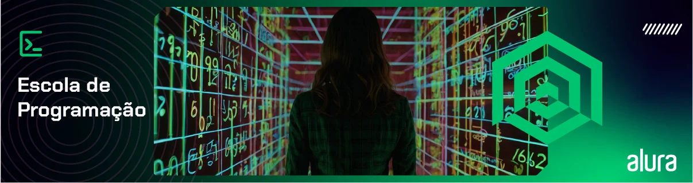

# Engenharia de Software

- ### [Design de código vs Arquitetura de software](./articles/DesignArquiteturaDeSoftware.md)

- ### [Arquitetura Hexagonal](./articles/ArquiteturaHexagonal.md)

- ### [Clean Architecture (Arquitetura Limpa)](./articles/CleanArchitecture.md)

## Pensamento Computacional

- ### [Curso - Pensamento computacional: fundamentos da computação e lógica de programação](./pensamentoComputacional/menu.md)
